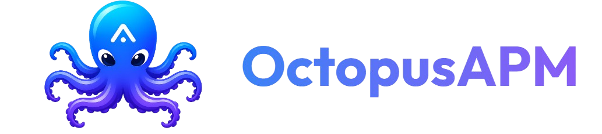

<div align="center">
  [](https://octopusapm.com/)
  <br /><br />

  
  
  

  <p><b>A modern, Dockerized Application Performance Monitoring (APM) and management dashboard tailored specifically for Apache Tomcat servers.</b></p>
</div>

---

## 📖 Overview

Octopus APM provides real-time log tailing, metric monitoring, automated background services, and an interactive setup wizard with a sleek React-based user interface. It simplifies Tomcat server management by offering a single, cohesive dashboard without the need for complex configuration files.

## ✨ Key Features

- **📊 Real-Time Monitoring:** Track CPU, Memory, and JVM metrics of your Tomcat instances live via an intuitive dashboard.
- **🛠️ Interactive Setup Wizard:** No complicated configuration files. Just run the container and set up your database via the UI on your first visit.
- **📜 Live Log Tailing:** Read and search Tomcat logs (`catalina.out`, `localhost.log`, etc.) directly from your browser using ultra-fast WebSockets.
- **🔐 Role-Based Access Control (RBAC):** Built-in `ADMIN` and `USER` roles for secure team collaboration. Easily manage who can view logs or change configurations.
- **🚨 Automated Alarms:** Set custom thresholds and receive real-time toast alerts when server resources are constrained.
- **🐳 Seamless Docker Integration:** Deploy anywhere in seconds. Built as a lightweight, multi-stage Alpine Docker image.

---

## 🚀 Quick Start (Docker)

You don't need to build the source code to use Octopus APM. The official pre-built Docker image is available on Docker Hub and contains everything you need.

### 1. Create `docker-compose.yml`

Create a `docker-compose.yml` file on your server (or use the one provided in the repository's `docker/` folder) with the following content:

```yaml
version: '3.8'

services:
  postgres:
    image: postgres:15-alpine
    container_name: octopus_postgres
    restart: always
    environment:
      POSTGRES_USER: postgres
      POSTGRES_PASSWORD: 1234
      POSTGRES_DB: apm_tool
    volumes:
      - pgdata:/var/lib/postgresql/data

  octopus-apm:
    image: octobuilds/octopus-tomcat-manager:latest
    container_name: octopus_apm_app
    restart: always
    ports:
      - "5000:5000" 
    environment:
      - PORT=5000
      - DB_USER=postgres
      - DB_PASS=1234
      - DB_HOST=postgres
      - DB_PORT=5432
      - DB_NAME=apm_tool
    depends_on:
      - postgres

volumes:
  pgdata:
```

### 2. Launch the Application

Run the following command in the same directory as your `docker-compose.yml`:

```bash
docker-compose up -d
```

### 3. Access the Dashboard

Open your browser and navigate to:
```
http://localhost:5000
```

---

## 🛠️ First Time Setup Wizard

When you launch the application for the first time, you will be greeted by the **Setup Wizard**.

1. The database credentials will be pre-filled based on the environment variables defined in your `docker-compose.yml`.
2. Simply click **Next** through the steps to initialize the database schema and tables.
3. At the end of the setup, your default **Admin Credentials** will be generated:
   - **Email:** `admin@octopusapm.com`
   - **Password:** `admin123`

> [!WARNING]
> You will be prompted to change this password upon your first login for security reasons. Please ensure you use a strong password.

---

## 💻 Tech Stack

Our stack is chosen for maximum performance, security, and developer experience.

### Frontend
- **React 18** (Vite)
- **TypeScript**
- **TailwindCSS** (for styling)
- **Socket.io-client** (for real-time logging & metrics)
- **React Hot Toast** (for notifications)

### Backend
- **Node.js** & **Express**
- **Prisma ORM** (PostgreSQL)
- **Socket.io** (WebSocket server)
- **JWT** (JSON Web Tokens for authentication)

### Infrastructure
- **Docker** (Multi-stage Alpine builds)
- **Docker Compose**

---

## 🏗️ Development & Building from Source

If you want to contribute or build your own custom version of the Docker image, clone the repository and run the build command.

### Building the Docker Image

```bash
git clone https://github.com/octobuilds/octopus-tomcat-manager.git
cd octopus-tomcat-manager
docker build -t octobuilds/octopus-tomcat-manager:latest -f docker/Dockerfile .
```

### Running Locally (Without Docker)

You can also run the application directly using Node.js. Make sure you have a PostgreSQL database running and update your `.env` variables accordingly in the `backend/` folder.

```bash
# Terminal 1: Backend
cd backend
npm install
npx prisma generate
npx prisma migrate deploy
npm run dev

# Terminal 2: Frontend
cd frontend
npm install
npm run dev
```

---

## 🤝 Contributing

We welcome contributions! Please follow these steps to contribute:
1. Fork the project.
2. Create your feature branch (`git checkout -b feature/AmazingFeature`).
3. Commit your changes (`git commit -m 'Add some AmazingFeature'`).
4. Push to the branch (`git push origin feature/AmazingFeature`).
5. Open a Pull Request.

## 📄 License

This project is licensed under the **MIT License**. See the LICENSE file for more details.
